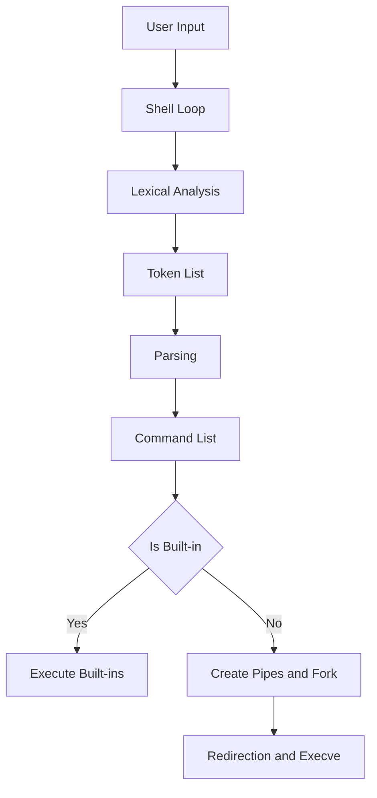
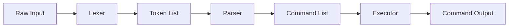
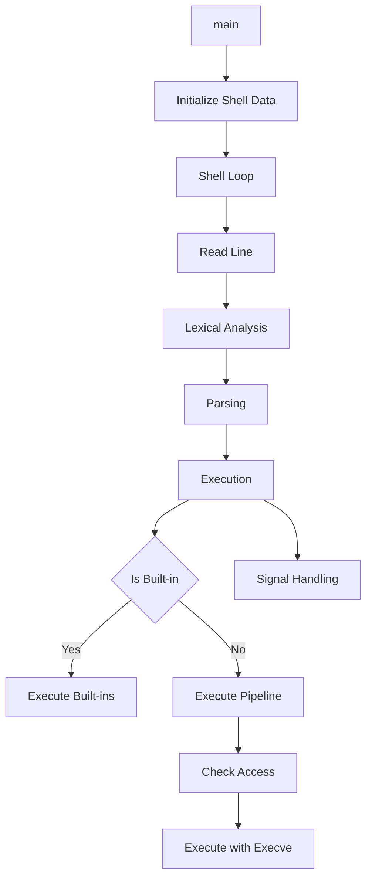

# Minishell

A **basic Unix shell** implementation written in **C**, designed for educational purposes and functional command-line use. This project demonstrates key systems programming concepts such as lexical analysis, parsing, process creation, and environment management.

---

## 📚 Table of Contents

- [Overview](#-overview)
- [System Architecture](#-system-architecture)
- [Purpose and Scope](#-purpose-and-scope)
- [Key Features](#-key-features)
- [Core Data Structures](#-core-data-structures)
- [Command Processing Pipeline](#-command-processing-pipeline)
- [Component Relationships](#-component-relationships)
- [Environment Management](#-environment-management)
- [Signal Handling](#-signal-handling)
- [Conclusion](#-conclusion)

---

## 📄 Overview

This document introduces the Minishell project and outlines its **purpose**, **features**, **architecture**, and **core components**. It serves as a starting point for understanding how the shell is structured and operates.

---

## 🏗️ System Architecture

Minishell uses a **pipeline-based architecture**. Input flows through clearly defined stages:

### Key Components:

- **Shell Loop** – Reads user input and starts processing
- **Lexer** – Breaks input into tokens
- **Parser** – Builds command structures
- **Executor** – Runs commands or pipelines
- **Environment Manager** – Manages shell variables
- **Signal Handler** – Controls signal behavior

> 📁 **Sources**:
> `src/minishell.c` (lines 17–26)
> `includes/minishell.h` (lines 51–53, 54, 77–95, 98–120, 164–171)

---

## 🎯 Purpose and Scope

Minishell is a simplified Unix shell that:

- Interprets and executes user commands
- Demonstrates how real shells work under the hood
- Uses a **modular architecture** to separate components

---

## 🚀 Key Features

| Feature               | Description |
|----------------------|-------------|
| Command Execution     | Run basic Unix commands with arguments |
| Command Piping        | Pipe output between commands using `\|` |
| Redirection           | Input (`<`), output (`>`), append (`>>`) support |
| Heredoc               | Support for heredoc (`<<`) functionality |
| Environment Variables | Manage and expand environment variables |
| Built-in Commands     | `cd`, `echo`, `pwd`, `export`, `env`, `unset`, `exit` |
| Signal Handling       | Handles `SIGINT` (Ctrl+C) and `SIGQUIT` (Ctrl+\) |
| Command History       | Track and recall past commands |

> 📁 **Sources**:
> `readme.md` (lines 5–13)
> `includes/minishell.h` (lines 142–162)

---

## 🧱 Core Data Structures

| Structure         | Description |
|------------------|-------------|
| `t_shell_data`    | Maintains overall shell state |
| `t_command`       | Represents a parsed command |
| `t_token`         | Lexer token output |
| `t_global_sig`    | Manages global signal and exit state |

> 📁 **Source**: `includes/minishell.h` (lines 28–49)

---

## 🔁 Command Processing Pipeline

The shell processes each command via the following stages:

1. **Input Acquisition**
2. **Lexical Analysis**
3. **Parsing**
4. **Execution**
5. **Output Handling**

> 📁 **Sources**:
> `includes/minishell.h` (lines 51–52, 77, 98)

---

## 🔗 Component Relationships

- Shows flow from startup to execution
- Illustrates relationships between major components

> 📁 **Sources**:
> `src/minishell.c` (lines 17–26)
> `includes/minishell.h` (lines 51–62, 142–162, 164–171)

---

## 🌱 Environment Management

Minishell uses two parallel environments:

| Environment Type     | Structure Field             | Description |
|----------------------|-----------------------------|-------------|
| Regular              | `t_shell_data.env`          | Active variables |
| Exported             | `t_shell_data.exportenv`    | Exported for child processes |

### Functions

- `get_env_value()`
- `set_env_var()`, `remove_env_var()`
- `set_export_env_var()`, `remove_exportenv_var()`
- Built-ins: `env`, `export`, `unset`

> 📁 **Sources**:
> `includes/minishell.h` (lines 37–43, 62–72, 143–158)

---

## 🛑 Signal Handling

Signal behavior adapts based on shell mode:

| Mode             | SIGINT (`Ctrl+C`)     | SIGQUIT (`Ctrl+\`)       |
|------------------|-----------------------|---------------------------|
| Interactive      | `signal_reset_prompt` | *Ignored*                 |
| Non-interactive  | `signal_print_newline`| `signal_print_newline`   |

Functions:
- `set_signals_interactive()`
- `set_signals_noninteractive()`

> 📁 **Source**: `includes/minishell.h` (lines 164–171)

---

## ✅ Conclusion

Minishell is a clean and modular shell implementation emphasizing **clarity** and **educational value**.

### Strengths:

- 📚 **Component Separation**: Lexer, Parser, Executor
- 🌐 **Dual Environment Handling**
- 🛡 **Signal Safety**
- 🔁 **Pipeline Support**
